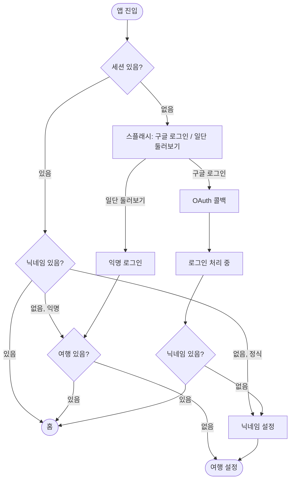
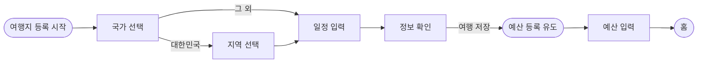
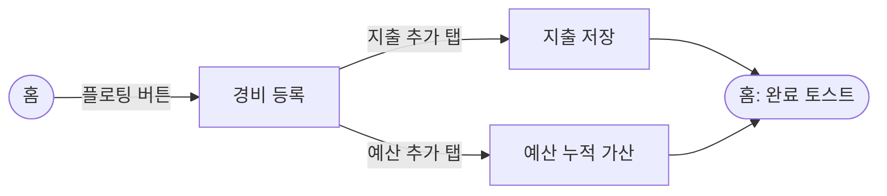

# Tripy 현행 화면정의서 (As-Is)

> **이 문서는 현재 배포된 구현을 코드에서 그대로 옮긴 기록입니다.**
> 개선 방향이나 지향점이 아니라 "지금 이렇게 동작한다"만 담았습니다.
> 개선 후 기준은 [`prd.md`](./prd.md)(To-Be)이며, 두 문서를 나란히 두고 비교하는 용도입니다.
>
> 기준 커밋: `main` / 작성일 2026-09-09
> 근거: `src/app` 전체 라우트, `src/contexts`, `src/hooks`, `supabase/migrations`

---

## 1. 서비스 개요 (구현 기준)

| 항목 | 내용 |
|---|---|
| 서비스 한 줄 설명 | 여행 단위로 예산을 정하고 지출을 기록해, 예산 대비 소비 상태를 확인하는 모바일 웹 가계부 |
| 로그인 수단 | 구글 OAuth, Supabase 익명 로그인(게스트) |
| 지원 통화 | KRW, USD, JPY, EUR |
| 화면 폭 | `max-width: 390px` 중앙 정렬 고정 |
| 데이터 | Supabase (`users`, `trips`, `expenses`) |
| 전역 상태 | `AuthProvider` > `TripProvider` (루트 레이아웃에서 전체를 감쌈) |
| 라우트 가드 | **서버 미들웨어 없음.** 화면별 클라이언트 검사만 존재하며 적용 범위가 제각각 |

---

## 2. 화면 인벤토리

구현된 라우트는 총 22개입니다. To-Be 문서의 4개 화면과 대응 관계를 함께 표기했습니다.

### 2.1 진입 / 인증 / 온보딩

| 라우트 | 화면명 | 비고 |
|---|---|---|
| `/` | 스플래시 · 로그인 | 진입점. 세션 상태에 따라 자동 분기 |
| `/landing` | 마케팅 랜딩 | 인증 가드 없음. 앱 내부에서 이 화면으로 보내는 코드 없음 |
| `/auth/callback` | OAuth 콜백 | 화면 없는 라우트 핸들러 |
| `/auth/session-sync` | 로그인 처리 중 | "로그인 중..." 텍스트만 표시 |
| `/nickname` | 닉네임 설정 | 정식 가입자 전용 온보딩 |
| `/error` | 오류 안내 | **구현돼 있으나 이 화면으로 보내는 코드가 없음** |

### 2.2 여행 설정 (To-Be의 "여행 설정" 1개 화면에 대응)

| 라우트 | 화면명 | 비고 |
|---|---|---|
| `/setup` | 여행지 등록 시작 | 안내와 CTA만 있는 인트로 |
| `/setup/country` | 국가 선택 | 33개국 목록 + 직접 입력 |
| `/setup/region` | 지역 선택 | **대한민국 선택 시에만 노출** |
| `/setup/date` | 일정 등록 + 정보 확인 | 한 라우트에서 2단계로 동작 |
| `/setup/confirm` | 예산 등록 유도 | 안내와 CTA만 있는 인트로 |
| `/budget` | 여행예산 등록 | 통화와 금액 입력 |

### 2.3 홈 / 지출 (To-Be의 "홈", "경비 등록"에 대응)

| 라우트 | 화면명 | 비고 |
|---|---|---|
| `/home` | 홈 | 예산 카드, 지출 리스트, 카테고리 필터 |
| `/expense` | 경비 등록 | "지출 추가" / "예산 추가" 2개 탭 |

### 2.4 여행 관리 (To-Be의 "여행 관리"에 대응)

| 라우트 | 화면명 | 비고 |
|---|---|---|
| `/travels` | 여행 관리 | 진행 중 / 종료 2개 탭 |
| `/travels/[id]/edit` | 여행지 수정 (국가) | 여행지만 수정 가능 |
| `/travels/[id]/edit/region` | 여행지 수정 (지역) | 국내 여행 전용 |

### 2.5 마이페이지 (To-Be에 대응 화면 없음)

| 라우트 | 화면명 | 비고 |
|---|---|---|
| `/mypage` | 마이페이지 | 프로필, 여행 통계, 카테고리 순위 |
| `/mypage/profile` | 프로필 수정 | 아바타 이미지, 닉네임 |
| `/mypage/settings` | 설정 | 약관, 문의, 탈퇴 진입 |
| `/mypage/delete-account` | 회원 탈퇴 | 사유 선택 후 즉시 삭제 |
| `/mypage/delete-account/complete` | 탈퇴 완료 | 정적 안내 화면 |

### 2.6 개발용 (제품 화면 아님)

`/preview/button`, `/preview/dropdown` 두 개의 컴포넌트 미리보기 화면이 프로덕션 빌드에 포함돼 있습니다.

---

## 3. 핵심 User Flow

### 3.1 진입 및 온보딩

**분기 규칙이 두 곳에서 다릅니다.** 진입 화면은 닉네임이 없을 때 익명 여부와 기존 여행 유무까지 보고 갈림길을 정하는 반면, 로그인 처리 화면은 닉네임 유무만 봅니다.

### 3.2 여행 생성

국내 여행은 6단계, 해외 여행은 지역 선택을 건너뛰어 5단계입니다. 여행 레코드는 정보 확인 단계에서 한 번 저장되며, 예산은 그 뒤 별도 수정으로 반영됩니다. 예산 화면에는 "나중에 할게요" 링크가 있어 예산 없이 홈으로 갈 수 있습니다.

### 3.3 지출 기록

---

## 4. 화면별 정의

### 4.1 스플래시 · 로그인 `/`

- **목적**: 로그인 수단을 고르고, 이미 세션이 있으면 적절한 화면으로 보낸다.
- **주요 요소**: 로고, 타이틀 "여행 비용 정리는 이제 트리피에서!", 버튼 "구글 로그인", "일단 둘러보기"
- **핵심 액션**
  - 구글 로그인: 현재 익명 세션이면 계정 연결 방식으로 승격시켜 데이터를 유지하고, 아니면 일반 OAuth 로그인
  - 일단 둘러보기: 익명 로그인으로 실제 세션을 발급
- **다음 화면**: 위 3.1 분기 참조
- **상태 처리**: 로딩 표시 없음. 구글 로그인 실패는 콘솔에만 남고 사용자에게 보이지 않음. 게스트 로그인 실패만 브라우저 기본 알림으로 안내

### 4.2 닉네임 설정 `/nickname`

- **목적**: 정식 가입자의 표시 이름을 정한다.
- **유효성**: 한글, 영문, 숫자만 허용하며 3자 이상 10자 이하. 입력창 자체도 10자로 제한
- **중복 확인**: 별도 "중복확인" 버튼을 눌러 통과해야만 "다음"이 활성화된다
- **안내 문구**: 사용 가능, 이미 사용 중, 형식 위반 세 가지 상태별 메시지
- **진입 조건**: 비로그인 상태로 들어오면 진입 화면으로 되돌린다
- **다음 화면**: 여행 설정 시작
- **상태 처리**: 저장 실패 시 안내 없음. 중복 조회가 네트워크 오류로 실패해도 "사용 가능"으로 판정될 수 있음

### 4.3 여행 설정 6단계

| 단계 | 화면 | 입력 | 필수 | 다음으로 넘기는 방식 |
|---|---|---|---|---|
| 1 | 여행지 등록 시작 | 없음 | - | 화면 이동만 |
| 2 | 국가 선택 | 국가 1개 | 필수 | 주소 쿼리 |
| 3 | 지역 선택 | 광역시도 1개 | 필수 | 주소 쿼리 |
| 4 | 일정 입력 | 출발일, 도착일, 당일치기 여부 | 출발일만 필수 | 화면 내부 상태 |
| 5 | 정보 확인 | 없음 | - | **여기서 여행 저장** |
| 6 | 예산 등록 | 통화, 금액 | 금액 필수 | 여행 정보 수정 |

- **국가 선택**: 33개국 목록에서 부분 일치 검색. 검색 결과가 없으면 입력한 문자열을 그대로 여행지로 쓰는 직접 입력 버튼이 나온다
- **지역 선택**: 17개 광역시도 하드코딩 목록
- **일정 입력**: 도착일은 선택 사항이며, 미선택이거나 당일치기면 출발일과 같은 날로 저장된다. **과거 날짜 제한이 없어 지난 날짜로도 여행을 만들 수 있다**
- **정보 확인**: 이 단계의 "다음"에서 여행이 저장된다. 저장되는 값은 제목(국가명 기반 자동 생성), 목적지(국내만 지역명, 해외는 비움), 시작일, 종료일이며 예산은 0, 통화는 원화로 고정 초기화된다
- **예산 등록**: 금액 입력 후 확인 모달을 거쳐 저장. "비상금 포함" 체크박스가 있으나 **선택해도 저장이나 계산에 전혀 반영되지 않는다**. 금액 상·하한 제약 없음
- **뒤로 가기**: 시작 화면에는 뒤로 가기 UI가 없다. 일정 화면의 확인 단계에서 뒤로 가면 이전 라우트가 아니라 같은 화면의 입력 단계로 돌아간다

### 4.4 홈 `/home`

**표시 항목**

| 항목 | 표시 라벨 | 실제 값 |
|---|---|---|
| 소비 합계 | 오늘 쓴 돈 | **전체 기간 지출 합계** (오늘 필터 아님) |
| 예산 | 하루 예산 | **여행 총예산** (일할 계산 아님) |
| 진행률 | 프로그레스 바 | 합계 나누기 총예산. 숫자 표기는 없음 |
| 여행 정보 | 제목, 상태 배지, 기간, 박수 | 상태 배지는 여행 존재 여부만 보고 "진행중"/"대기중" |
| 지출 리스트 | 카테고리, 날짜, 금액 | 등록 최신순 고정 |

- **남은 금액은 표시되지 않는다.** To-Be 문서가 홈의 목적으로 적은 세 값 중 하나가 현재 화면에 없다
- **필터**: 카테고리 6종 다중 선택. 즉시 반영되며 초기화 버튼은 없다. **필터는 리스트에만 적용되고 상단 합계는 항상 전체 기준이다**
- **정렬**: UI 없음
- **이동 경로**: 플로팅 버튼으로 경비 등록, 하단 탭으로 여행 관리 / 홈 / 마이페이지
- **상태 처리**: 로딩 화면에 **최소 1.5초 강제 지연**이 걸려 있다. 지출 조회 실패는 화면에 표시되지 않고 빈 목록으로 진행된다. 여행 정보 조회 실패 메시지는 만들어져 있으나 홈이 구독하지 않아 표시되지 않는다
- **빈 상태**: "아직 등록된 지출 내역이 없어요." 필터 결과가 0건일 때도 같은 문구가 나온다

### 4.5 경비 등록 `/expense`

두 개의 탭으로 나뉩니다.

| 입력 | 지출 추가 탭 | 예산 추가 탭 | 필수 |
|---|---|---|---|
| 통화 | O | O | 기본값 여행 통화 |
| 금액 | O | O | 필수 |
| 결제수단 (카드/현금) | O | **O (예산 탭에도 노출)** | 필수 표시, 기본값 카드 |
| 카테고리 | O | X | **선택 안 해도 저장되며 미선택 시 "기타"로 기록** |
| 날짜 | O | O | 필수. 여행 기간 내로 제한 |
| 내용 | O | O | 선택. 글자수 제한 없음 |

- **지출 저장**: 여행, 금액, 통화, 카테고리, 결제수단, 날짜, 내용이 지출 테이블에 기록된다
- **예산 저장**: 총예산 한 컬럼만 갱신하며 **기존 값에 더하는 누적 방식이다.** 덮어쓰기나 감액 수단이 없고, 화면에 현재 예산액도 보이지 않는다
- **상태 처리**: 저장 실패는 브라우저 기본 알림. 성공하면 홈에서 "경비 등록이 완료되었습니다." 토스트가 3초간 뜨며, 지출과 예산 어느 쪽이든 같은 문구가 나온다

### 4.6 여행 관리 `/travels`

- **탭**: 진행 중인 여행, 종료된 여행
- **분류 기준**: 데이터베이스 값이 아니라 **화면에서 오늘 날짜와 종료일을 비교해 나눈다.** 보관 처리 컬럼은 이 화면에서 쓰지 않는다
- **정렬**: 시작일 내림차순 고정
- **카드**: 국기 이모지(제목 문자열에서 국가명을 찾아 매칭), 제목, 기간, 진행 중이면 디데이 배지, 종료면 "종료" 배지
- **여행 선택**: **카드를 눌러도 아무 일도 일어나지 않는다.** 상세 화면이나 현재 여행 전환 기능이 없다. 동작하는 것은 진행 중 카드의 수정 아이콘과 종료 카드의 삭제 아이콘뿐
- **삭제**: 종료된 여행만 가능하며 확인 모달을 거친다. **여행만 지우고 그 여행에 속한 지출은 지우지 않는다**
- **수정 범위**: 여행지(국가와 지역)만 바꿀 수 있다. 기간, 예산, 통화를 고치는 화면은 없다
- **인증**: 앱 전체에서 이 화면만 비로그인 접근을 진입 화면으로 되돌린다
- **빈 상태**: 탭별로 서로 다른 안내 문구를 제공한다

### 4.7 마이페이지 `/mypage`

- **표시**: 아바타, 닉네임(없으면 "여행자"), 고정 문구 "꼼꼼한 가계부 지킴이!", 여행 횟수, 지출 총액, 여행 일수, 카테고리 순위 상위 5개
- **주의**: 지출 총액은 **통화 구분 없이 금액을 그대로 더한 값**이며 원화로 표기된다
- **이동**: 설정, 프로필 수정, 여행 관리, 로그아웃
- **비로그인**: 되돌리지 않고 빈 값 상태로 화면을 그대로 보여준다. 여행 관리 화면과 동작이 다르다

### 4.8 설정과 회원 탈퇴

- **설정**: "공지사항"과 "이용안내"는 목록에 있으나 **연결된 경로가 없어 눌러도 반응하지 않는다.** 개인정보 처리방침과 피드백은 외부 링크, 메일 문의는 메일 앱 실행
- **회원 탈퇴**: 사유를 고르는 화면과 완료 화면 두 단계. **선택한 사유는 어디에도 저장되거나 전송되지 않으며**, 사유를 고르지 않아도 버튼이 눌린다. 별도 재확인 모달 없이 버튼 한 번으로 즉시 삭제된다
- **삭제 범위**: 지출, 여행, 사용자 프로필을 지우고 로그아웃한다. **인증 계정 자체와 업로드된 프로필 이미지는 남는다.** 각 삭제 요청의 실패 여부를 확인하지 않아 일부가 실패해도 완료 화면으로 넘어간다

---

## 5. 데이터 모델 (현행)

| 테이블 | 주요 컬럼 |
|---|---|
| `users` | `id`, `email`, `display_name`, `avatar_url` |
| `trips` | `id`, `user_id`, `title`, `destination`, `start_date`, `end_date`, `total_budget`, `currency`, `is_archived` |
| `expenses` | `id`, `trip_id`, `amount`, `currency`, `category`, `payment_method`, `description`, `expense_date` |

- 카테고리는 데이터베이스 열거형으로 고정돼 있습니다. 숙소, 식비, 교통, 액티비티, 쇼핑, 기타 6종이며 사용자가 추가하거나 편집할 수 없습니다
- 결제수단은 카드와 현금 2종입니다
- 모든 테이블에 행 수준 보안이 걸려 있어 본인 데이터만 조회하고 수정할 수 있습니다
- **환율을 저장하는 컬럼은 없습니다**

---

## 6. 도메인 규칙 (현행 동작)

### 6.1 환율

- 홈 화면에 들어올 때 한 번 조회하며, 브라우저 세션 저장소에 **1시간 캐시**합니다
- 외부 환율 API가 실패하면 코드에 내장된 고정 환율로 대체합니다
- **지출 등록 시점의 환율을 저장하지 않습니다.** 홈을 열 때마다 그 시점 환율로 전체 지출을 다시 환산합니다
- 결과적으로 **아무 조작을 하지 않아도 시간이 지나면 누적 지출 금액이 달라집니다**
- 환산은 홈 상단 합계에만 적용되고, 지출 목록의 개별 금액과 총예산은 환산하지 않습니다

### 6.2 게스트 처리 (두 종류가 공존)

| 구분 | 진입 경로 | 저장 위치 | 로그인 승격 |
|---|---|---|---|
| 익명 세션 게스트 | 진입 화면의 "일단 둘러보기" | Supabase (정상 저장) | 계정 연결로 데이터 유지 |
| 세션 없는 체험 모드 | 홈 주소로 직접 접근 | 브라우저 저장소 + 하드코딩 더미 데이터 | 없음. 데이터 이관 경로 없음 |

두 번째 경로에서는 하드코딩된 가상의 일본 여행과 지출 2건이 보입니다. 이 상태에서 등록한 지출은 브라우저에만 남고 서버로 가지 않습니다.

### 6.3 예산

- 여행 생성 시 0으로 시작합니다
- 예산 등록 화면에서 처음 설정하고, 이후에는 경비 등록의 예산 탭에서 **더하는 것만 가능합니다**
- 감액하거나 특정 값으로 덮어쓰는 수단이 없습니다

---

## 7. To-Be 문서와의 주요 차이

`prd.md`와 이 문서를 비교할 때 확인이 필요한 지점입니다.

| 항목 | 현행 (As-Is) | To-Be 문서 |
|---|---|---|
| 화면 수 | 22개 라우트 | 4개 화면 |
| 다중 통화 | 4종 지원, 환율 재환산 | 언급 없음 |
| 결제수단 | 카드/현금 입력 및 저장 | 언급 없음 |
| 계정 관리 | 로그인, 닉네임, 프로필, 탈퇴 | 언급 없음 |
| 게스트 | 두 방식 공존 | 언급 없음 |
| 남은 금액 | 화면에 없음 | 홈의 핵심 표시 항목 |
| 카테고리 | 6종 고정, 편집 불가 | "확인 필요"로 남아 있음 |

---

## 8. 개선 검토가 필요한 지점

구현을 읽으며 발견한, 화면 통합 여부와 무관하게 결정이 필요한 항목입니다.

**데이터 정합성**

1. 환율 기준 시점을 정해야 합니다. 등록 시점 고정이 아니면 과거 지출 합계가 계속 변합니다
2. 여행을 지울 때 그 여행의 지출이 남습니다
3. 탈퇴 시 인증 계정과 프로필 이미지가 남습니다
4. 마이페이지 지출 총액이 통화를 구분하지 않고 단순 합산됩니다

**표시와 실제의 불일치**

5. 홈의 "오늘 쓴 돈"은 전체 기간 합계이고, "하루 예산"은 총예산입니다
6. 홈 필터가 리스트에만 적용되고 상단 합계에는 적용되지 않습니다
7. 홈에 남은 금액이 없습니다

**동작하지 않는 요소**

8. 예산 화면의 "비상금 포함" 체크박스가 아무 데도 반영되지 않습니다
9. 설정의 "공지사항"과 "이용안내"에 연결 경로가 없습니다
10. 탈퇴 사유가 저장되지 않습니다
11. 여행 관리에서 카드를 눌러도 아무 일도 일어나지 않습니다
12. 오류 화면으로 보내는 코드가 없습니다

**입력 검증**

13. 출발일에 과거 날짜 제한이 없습니다
14. 카테고리가 필수가 아니어서 미선택 시 조용히 "기타"로 저장됩니다
15. 예산 탭이 누적 가산만 되고 감액 수단이 없습니다

**흐름**

16. 진입 화면과 로그인 처리 화면의 분기 규칙이 다릅니다
17. 인증 가드가 여행 관리 화면에만 있습니다
18. 컴포넌트 미리보기 화면이 프로덕션 빌드에 포함돼 있습니다
